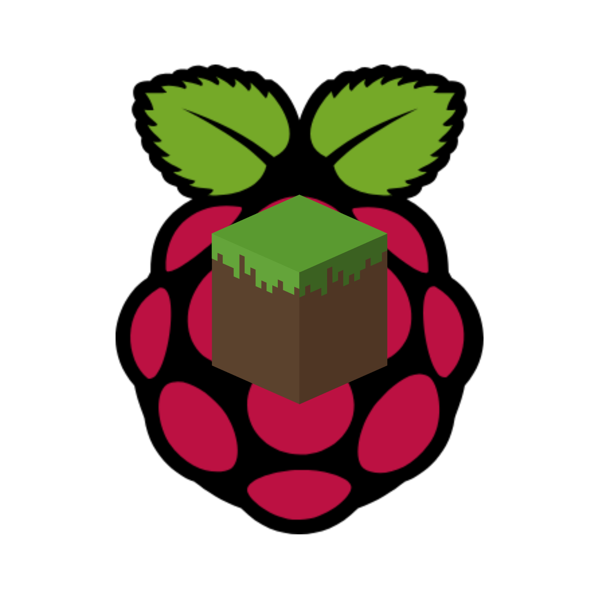

<div align="center">
  
  <h1>PiChunk</h1>
  <p><i>An ultra-lightweight, from-scratch Minecraft 1.21.4 (Java Edition) server designed specifically for the first-generation Raspberry Pi Zero W.</i></p>
</div>

***

## What is PiChunk?

PiChunk is a custom-built, zero-dependency Minecraft server written entirely in Go. It implements the modern 1.21.4 (Protocol 769) Minecraft protocol from scratch without relying on large external libraries. 

The server is heavily optimized to run on a single CPU core (like the BCM2835 inside the Pi Zero W), locking `GOMAXPROCS` to 1. It operates as an extremely lightweight server with dynamic chunk allocation.

### Core Features

*   **Dynamic Multi-Chunk Grid**: Control your server size via the config file. A highly optimized map-based grid system expands the world to whatever radius you set.
*   **Persistent World State**: The server intelligently intercepts shutdowns and writes all chunk data to a binary `world.bin` file, loading it seamlessly on reboot.
*   **Experimental Game Modes**: Players spawn in Creative by default and can switch using the integrated `/gamemode` chat commands.
*   **Full Synchronization**: Experience real-time multiplayer with perfectly synced sneaking, arm swinging, equipment rendering, and block placements.
*   **Terminal Dashboard**: Launch with the `-gui` flag to access a beautiful, live-updating server dashboard in your terminal without any extra dependencies.

## Getting Started

### 1. Build and Run

If you have Go installed, you can build the project. We recommend compiling the binaries into a `bin/` directory to keep your workspace clean.

```bash
mkdir bin
go build -o bin/pichunk.exe ./...
./bin/pichunk.exe
```

### 2. TUI Dashboard Mode

For a live-updating dashboard showing server stats, use the `-gui` flag:

```bash
./bin/pichunk.exe -gui
```

### 3. Configuration

On the first run, a `server.properties` file will be generated in the server root:

```properties
# PiChunk Server Properties
server-name=PiChunk \u00bb Custom Config Server
max-players=20
view-distance=10
chunks=4
```

*   `chunks`: Sets the size of the world grid (e.g. 4 generates a 4x4 chunk area).
*   `server-name`: Changes the Message of the Day (MOTD) displayed on the multiplayer server list.

## Deploying to Raspberry Pi Zero W

Since PiChunk is written in Go, you can cross-compile it for the Pi Zero W (which uses an ARMv6 architecture) from any computer:

```bash
# On Windows PowerShell
$env:GOOS="linux"
$env:GOARCH="arm"
$env:GOARM="6"
go build -o bin/pichunk_arm6 ./...
```

Transfer the binary to your Pi using `scp`:

```bash
scp bin/pichunk_arm6 pi@YOUR_PI_IP:~/pichunk
```

On your Pi, make it executable and run it!

```bash
chmod +x ~/pichunk
./pichunk
```
